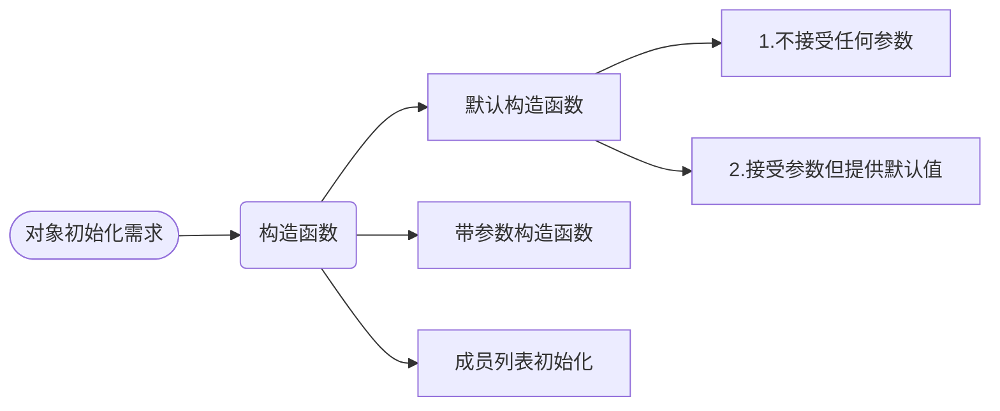

# 一、泛型


# 二、基于对象

C++本身就提供了很多我们经常用到的类，例如：string、vector等。

* 类对象有很多种初始化方法，如string
* 每个类都有一组操作函数，如`empty()`、`size()`等


有时候我们不得不自己设计符合自己需求的类，一般而言，类由两部分组成：

1. `public`：操作函数、运算符。二者称为成员函数，代表class的公开接口供class的用户使用。
2. `private`：实现细节。一般由与class相关的数据（只能被类成员函数或友元类访问），以及操作函数的实现（类内实现会自动被视为**inline**函数）细节组成。


【**实现一个栈**】

设计一个类首先以该从抽象开始。以栈这种数据结构为例，涉及到压入数据`push()`、取出数据`pop()`、压入前确认栈是否已满`full()`、取数据前确认是否为空`empty()`、查询栈内元素个数`size()`、查看栈顶元素`peek()`等操作。

```C++
class Stack
{
    public:
        bool push(const string&);
        bool pop(string &elem);
        bool empty();
        bool full();
        bool peek(string &elem);
        int size(){return _stack.size();}
    private:
        vector<string> _stack;  //在data member前加短横线
};
```

栈的元素填充：

```C++
void fill_stack(Stack &stack,istream &is = cin)
{
    string str;
    while(is >> str && !stack.full())
        stack.push(str);
    cout<<"Read in"<<stack.size()<<"elements\n";
}
```

成员函数的实现：

```C++
inline bool Stack::empty()   //inline成员函数定义都应该放在Stack.h文件中
{
    return _stack.empty();
}

inline bool Stack::full()    
{
    return _stack.size() == _stack.max_size();
}

bool Stack::pop(string &elem)  //非inline成员函数定义应该放在程序代码文件Stack.cpp中
{
    if(empty())
        return false;
    elem = _stack.back();
    return true;
}

bool Stack::peek(string &elem)
{
    if(empty())
        return false;
    elem = _stack.back();
    return true;
}

bool Stack::push(const string &elem)
{
    if(full())
        return false;
    _stack.push_back(elem);
    return true;
}
```


> 到此为止，还未完成Stack类的完整定义，还需要加入构造与析构函数。


【**数列引入构造函数**】

每个数列很适合设计为类，每个数列需要记住自己的长度、元素个数、起始位置等。

例如将斐波那契数列抽象为`Fibonacci`类：

`Fibonacci fib1(7,3);  //七个元素，从位置3开始`

佩尔数列（a1=0，a2=1，...，an=2*an-1+an-2）抽象为`Pell`类：

`Pell pel(10);    //十个元素，默认从位置1开始`

斐波那契数列拷贝初始化;

`Fibonacci fib2(fib1);  //fib2是fib1的副本`


```C++
class Triangular  //Triangular数列类
{
    public:
        ...
    private:
        int _length;    //长度
        int _beginPos;  //起始位置
        int _next;      //下一个元素
};
```


我们需要考虑 如何初始化，因为编译器不会自动处理。因此我们需要编写用于初始化数据成员的***构造函数***。

构造函数需要遵循以下语法规则：

* 无返回值
* 无返回类型
* 可***重载***

```C++
// 一组重载的构造函数
class Triangular
{
    public:
        Triangular();  //默认构造函数
        Triangular(int len);
        Triangular(int len,int beginPos);
        ...
};
```

类的对象被定义后，***编译器会自动根据获得的参数挑选出应该被调用的构造函数***。

```C++
Triangular t1;          //调用默认构造函数
Triangular t2(10,3);    //调用第三种构造函数
Triangular t3 = 8;      //调用单一参数的第二种构造函数

Triangular t4();        //此行将t4定义为一个函数，返回对象，无法定义对象
```

默认构造函数除恶了不接受任何参数的情况，还有一种情况是提供了默认值：

```C++
class Triangular
{
    public:
        Triangular(int len = 1,int beginPos = 1);  //这种情况更常见
    ...
};
```


【**成员初始化列表**】

除了默认构造函数和带参数的构造函数外，还有一种构造函数语法是***成员初始化列表***（***member initialization list***）：

```C++
Triangular::Triangular(const Triangular &rhs):
                      _length(rhs._length),_beginPos(rhs._beginPos),_next(rhs._next){}
```

**成员初始化列表就是在构造函数参数列表冒号后面，一个以逗号分隔的列表**。


【**构造函数小结**】




【**析构函数**】

析构函数的作用是在对象生命周期结束后，自动调用析构函数**“善后”**。主要工作是：**释放**在构造函数中或对象生命周期中分配的**资源**。

析构函数语法规则：

* 无返回值、无参数
* class名称前加`~`
* 不能被重载
* 并非绝对必要

```C++
class Matrix
{
    public:
        Matrix(int row,int col):_row(row),clo(cow){_pmat = new double[row * col];}
        ~Matrix(){delete [] _pmat;}
    private:
        int _row;
        int _col;
        double* _pmat;
};
```

我们通过Matrix本身的构造函数和析构函数，完成了***heap内存***的自动管理。


【**拷贝构造函数**】

有时候我们会以类的一个**对象来初始化另一个对象**，例如：

```C++
Triangular t1(8);
Triangular t2 = t1;
```

此时数据成员会被依次复制，即`_length`、`_beginPos`、`_next`都会依次从`t1`复制到`t2`，称为默认的***成员逐一初始化***（default memberwise initialization）。

但这种初始化方法不适合`Matrix`对象的初始化：

```C++
Matrix mat1(4,4);  //初始化一个4行4列的矩阵对象
/*
*实质上是调用构造函数，声明一个指针"_pmat1"指向一个程序空闲空间内的一块内存（数组）
*/
Matrix mat2 = mat1; 
/*
*初始化mat2后，声明一个指针"_pmat2"指向同一块内存
*/
```

从上例可以看出，如果`mat1`调用析构函数释放内存空间后，而`mat2`的指针仍然指向该内存块，若再对被释放的空间进行操作将会导致严重错误。


在这里我们需要改变“成员逐一初始化”的模式，引入***拷贝构造函数***（copy constructor）概念。


Matrix类的设计者提供一个拷贝构造函数来改变成员逐一初始化模式：

`Matrix::Matrix(const Matrix &rhs){};`

拷贝构造函数唯一参数是一个**常量引用**（const reference），指向一个Matrix对象。


函数体的实现是为了拜托对之前内存空间的依赖，所以可以考虑产生一个***独立***的数组（内存空间）副本，这样***某个对象的析构就不会影响到另一个对象***。

```C++
Matrix::Matrix(const Matrix &rhs):_row(rhs._row),_col(rhs.col)
{
    int elemNum = _row * _col;
    _pmat = new double[elemNum];
    //产生副本
    for(int i = 0;i < elemNum;i++)
    {
        _pmat[i] = rhs._pmat[i];
    }
}
```

> 在我们设计类时，需要问问自己，在此class之上使用成员逐一初始化是否合适；如果合适就不需要提供额外的拷贝构造函数，否则我们就要编写拷贝构造函数且在其中编写正确的初始化操作。


【**可变（mutable）和不可变（const）**】

有时候class设计者需要告诉编译器，某些成员函数不会改变对象的数据成员。

```C++
class Triangular
{
    public:
        //const member function
        int length()       const {return _length;}
        int beginPos()     const {return _beginPos;}
        int elem(int pos)  const;
        //non-const member function
        bool next(int &val);
        void next_reset() {_next = _beginPos - 1;}
    private:
        int _length;
        int _beginPos;
        int _next;
        //static data member
        static vector<int> _elems;
};
```


# 三、面向对象

> 关于基于对象和面向对象的编程范式区别，可以参考侯捷的C++视频教程。